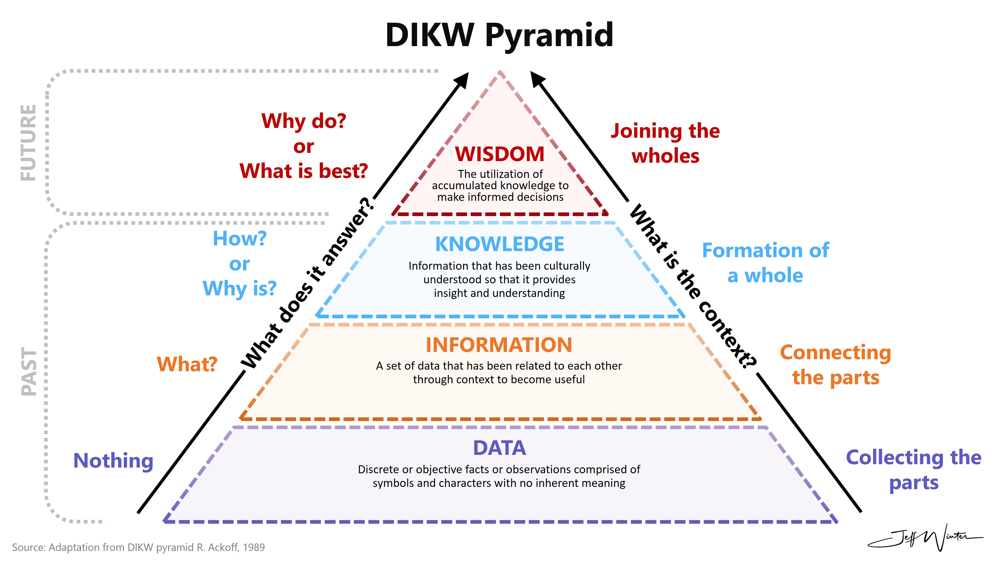
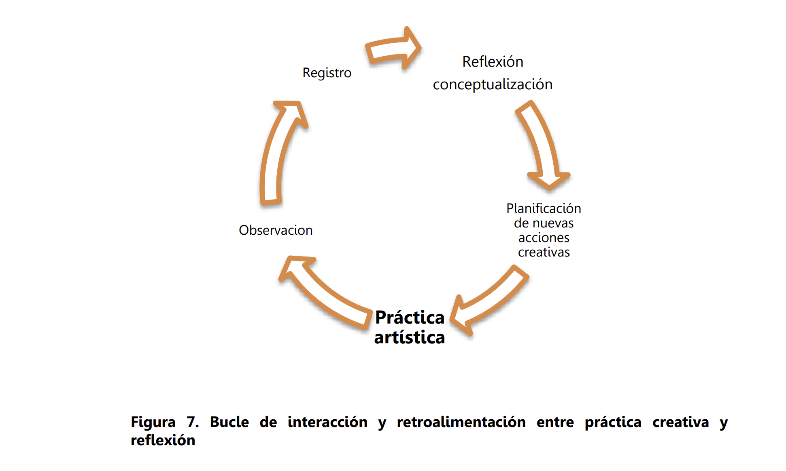

# Taller escritura protocolos para mujeres, personas trans, queer y no binares

## Estructura taller

14:00 - 14:10 Presentación del taller y les instructores por Emi  
14:10 - 14:40 Presentación de Marianne (metodología de investigación y marco teórico)  
14:40 - 14:50 Preguntas para Marianne  
14:50 - 15:20 Presentación de Jorge (enfoques investigación en Tecnología Musical)  
15:30 - 15:40 Preguntas para Jorge  
15:40 - 16:10 Presentación de Emi (Normas APA y recomendaciones de estilo)  
16:10 - 16:20 Preguntas para Emi  
16:20 - 16:50 Presentación de Anita (Estructura y ejercicio)   
16:50 - 17:00 Preguntas para Anita   
17:00 - 18:00 Ejercicio por pares  
18:00 - 19:00 Preguntas finales  

## Metodología de la investigación en música

### ¿Qué es la metodología de la investigación ?

Mario Bunge en [La ciencia, su método y su filosofía.](https://posgrado.unam.mx/musica/lecturas/LecturaIntroduccionInvestigacionMusical/epistemologia/Mario-Bunge-la-Ciencia-su-Metodo-y-Filosofia.pdf) propone lo siguiente:

### Algunas definiciones

#### Epistemología
	La define como una rama de la filosofía que estudia la investigación científica y el conocimiento científico que produce.  

#### Ciencia
	
    Considera que crece a partir del conocimiento común y lo rebasa. Sistema de ideas en desarrollo que utiliza el razonamiento lógico y la verificación empírica para generar, organizar y sistematizar el conocimiento sobre la realidad.

#### Metodología de la investigación
	
    Área de conocimiento que trata sobre cómo procede la ciencia, especialmente en la construcción y desarrollo del conocimiento.

#### Hipótesis
	
    Enunciados generales de una teoría a partir de los cuales se pueden derivar proposiciones que se pueden comprobar.

## Construcción del conocimiento académico

Propuesta de Jennifer Rowley en [The winsdom herarchy](/taller-escritura-protocolos/pdf/rowley-2007-the-wisdom-hierarchy-representations-of-the-dikw-hierarchy.pdf)

Ampliación de la propuesta de [DIKW](/taller-escritura-protocolos/pdf/knowledge-beyond-dikw-herarchy.pdf) más allá de la jerarquía, de Bratianu, C. y Benjinaru, R. (2023) 

### Preguntas

¿Cómo se construye el conocimiento en áreas del conocimiento como las Medicina, Filosofía, Física, Matemáticas, Historia, Economía?

### División de las aéreas del conocimiento universitario (UNAM)

#### Área 1. 
Ciencias Físico-Matemáticas y de las Ingenierías

#### Área 2.
Ciencias Biológicas y de la Salud

#### Área 3.
Ciencias Sociales

#### Área 4.
Artes y Humanidades

### Paradigmas

Referencia: [Filosofía de las Ciencias Humanas y Sociales](https://doctoradohumanidades.wordpress.com/wp-content/uploads/2015/04/mardones-y-ursua-filosofc3ada-de-las-ciencias-humanas-y-sociales.pdf) por J. M. Mardones y N. Ursua. 

- Empírico-analítica
- Fenomenológica, hermenéutica y linguística.
- Dialéctica o crítica hermeneutica. 
- [Investigación artística](http://rlopezcano.blogspot.com/)

López Cano, R y San Cristóbal Opazo, U. pp. 169. 

## Preparación tema

 #### [Elegir un tema de interés](https://cpalazzo.wordpress.com/wp-content/uploads/2013/07/10blaxter-loraine-hughes-christina-y-tight-malcom-cap-3-reflexionar-sobre-los-metodos1.pdf).
 ¿Teórico, práctico, tecnológico?

### Definir propósito
¿Qué quiero hacer?   
¿Por qué lo quiero hacer?   
¿Cómo se vincula con mi trabajo previo?   
¿Por qué aplicar en el Posgrado en Música?  
¿Cómo lo haré?  
¿Con quiénes?  
¿Quién me podría [asesorar](https://posgrado.unam.mx/musica/tutores/disponibilidad-de-tutores/nucleo-basico.php) y porqué esa persona?  
¿Cuál es la pertinencia de mi investigación en el campo de la música y tecnología?  
¿Qué quiero lograr con mi investigación?  
En lo específico ¿cuál es mi unidad de estudio?  
¿Quién a trabajado temas similares?  
¿Cuál es el aporte o distintivo de mi investigación? 

###  Estado del Arte 
- Revisar investigaciones previas y actuales. (Estado del Arte)
- Identificar investigaciones similares, aportes de su investigación y puntos de convergencia y díalogo. 
- Aprovechar los recurso de sus universidades. Ejemplo: [BIDIUNAM](https://www.bidi.unam.mx/)

### Recursos adicionales

- [JAR](https://www.jar-online.net/es)  
- [Cómo se hace una investigación.](https://cpalazzo.wordpress.com/wp-content/uploads/2013/07/10blaxter-loraine-hughes-christina-y-tight-malcom-cap-3-reflexionar-sobre-los-metodos1.pdf ), 
Blaxter, L., Hughes, C. y Tight, M. 
- [Investigación en música](https://www.csmmurcia.com/wp-content/uploads/2022/07/MIM-I.pdf)
- [Cómo hacer tu primer trabajo de investigación](https://api.pageplace.de/preview/DT0400.9788418193637_A40125700/preview-9788418193637_A40125700.pdf), Judit Bell
- [Investigación artística profesional en Lationamérica](https://erevistas.publicaciones.uah.es/ojs/index.php/quodlibet/article/view/779/374), Raúl López Cano. 
- [CMMAS e Ideas Sonicas](https://www.cmmas.org/)
- [Cómo hacer una tesis](https://www.ucm.es/escrituraacademica/file/9-manual-td-eco), Humberto Eco.
 

__Consejo:__ Evita en la medida de lo posible el uso de ChatGPT con el fin de darle más autenticidad a tu proyecto. Si lo ocupas, dale preferencia a la mejora de la redacción. Si es para expandir tus ideas toma en consideración la perspectiva crítica propuesta por Lluis Codina sobre el [uso de herramientas de IA con perspectiva crítica](https://www.lluiscodina.com/chatgpt-educadores/)

## Ejercicio

Armar la estructura metodológica de mi investigación (Protocolo de investigación). 

- Abre la convocatoria del Posgrado en [Maestría](https://posgrado.unam.mx/musica/admision/guia-protocolo-maestria.php) o [Doctorado](https://posgrado.unam.mx/musica/admision/guia-protocolo-doctorado.php) según sea el caso. 
- En un documento de texto copia los puntos sugeridos en la guía para realizar el protocolo. 
- Comenzar a llenar con lluvia de ideas y esbozos de las partes en las que se tenga mayor claridad. 
- Deja pasar unas horas o un par de días y vuelve a tu documento. 
- En lo que el tiempo pasa busca inspiración, lee, visita museos, ve a conciertos, platica con tus amigas y personas cercanas sobre tu proyecto. 
- Aprovecha los momento espontáneos de ideas y anótalas en un post-it, blog de notas o directo en tu archivo de texto. No te preocupes por la estructura, gramática o errores de dedo solo escribe. 
- Anota en tu calendario espacios de trabajo en los que sólo te concentres, aunque sea por una o dos horas, exclusivamente en escribir. 
- Con al menos una semana de anticipación, ingresa a la plataforma y realiza la carga de los documentos. 

__Recuerda: El documento más importante, después de tu título o acta de grado es un Protocolo de Investigación.__

## Tipos de metodologías de investigación

### Según el Enfoque  

a) Cualitativa

    Explora fenómenos en profundidad, con un enfoque interpretativo y subjetivo.
    Ejemplo: Estudios de caso, entrevistas abiertas, observación participante.

b) Cuantitativa

    Analiza datos numéricos para identificar patrones y relaciones.
    Ejemplo: Encuestas, experimentos con variables controladas, análisis estadístico.

c) Mixta

    Combina elementos cualitativos y cuantitativos para ofrecer una visión más completa.
    Ejemplo: Encuestas (cuantitativo) y entrevistas (cualitativo) en un mismo estudio.

### Según el Propósito  

a) Exploratoria  

    Busca conocer o descubrir un fenómeno poco estudiado.
    Ejemplo: Investigación sobre el uso de nuevas tecnologías en la composición musical.

b) Descriptiva

    Detalla las características de un fenómeno sin establecer relaciones causales.
    Ejemplo: Análisis de las características de compositores que usan inteligencia artificial.

c) Explicativa

    Examina las causas y efectos de un fenómeno.
    Ejemplo: Cómo el uso de sintetizadores afecta la percepción emocional en la música.

d) Experimental

    Manipula variables en condiciones controladas para observar sus efectos.
    Ejemplo: Pruebas con software musical para medir la creatividad de los usuarios.

e) Correlacional

    Busca establecer relaciones entre variables sin manipularlas.
    Ejemplo: Relación entre el nivel de formación en tecnología y la adopción de herramientas digitales en la música.

### Según la Estrategia  

a) Estudio de Caso

    Análisis en profundidad de un individuo, grupo o situación específica.
    Ejemplo: Estudio de un compositor que integra algoritmos en su proceso creativo.

b) Investigación Acción

    Combina la investigación con la acción práctica para resolver problemas.
    Ejemplo: Implementación de talleres interactivos para enseñar composición digital.

c) Etnografía

    Examina culturas o comunidades en su entorno natural.
    Ejemplo: Investigación sobre comunidades de artistas digitales y su interacción tecnológica.

d) Longitudinal

    Observa cambios o evoluciones en el tiempo.
    Ejemplo: Seguimiento de la evolución del uso de tecnología en la educación musical durante una década.

e) Transversal

    Analiza datos de un momento específico en el tiempo.
    Ejemplo: Encuesta actual sobre el uso de software musical entre músicos profesionales.

f) Investigación Bibliográfica o Documental

    Analiza documentos, libros y publicaciones previas.
    Ejemplo: Revisión de la literatura sobre inteligencia artificial en la música.

### Según el Método de Recolección de Datos 

a) Observacional

    Observa fenómenos directamente sin intervenir.
    Ejemplo: Documentar cómo músicos interactúan con herramientas de realidad virtual.

b) Experimental

    Realiza pruebas en condiciones controladas para medir efectos específicos.
    Ejemplo: Comparar el impacto de diferentes algoritmos generativos en la composición musical.

c) Encuestas y Cuestionarios

    Recolecta datos mediante preguntas estandarizadas.
    Ejemplo: Encuestas sobre la percepción de músicos sobre nuevas tecnologías.

d) Entrevistas

    Obtiene datos a través de preguntas abiertas y conversacionales.
    Ejemplo: Entrevistas a desarrolladores de software musical.

e) Análisis de Contenido

    Examina medios de comunicación, textos o producciones culturales.
    Ejemplo: Análisis de letras de canciones generadas por inteligencia artificial.

### Según el Alcance de la Investigación  

a) Básica  

    Busca expandir el conocimiento sin un propósito práctico inmediato.
    Ejemplo: Estudio teórico sobre la interacción entre inteligencia artificial y creatividad musical.

b) Aplicada

    Busca resolver problemas prácticos.
    Ejemplo: Desarrollo de una aplicación para enseñar teoría musical con realidad aumentada.

c) Evaluativa

    Evalúa la efectividad de programas o intervenciones.
    Ejemplo: Evaluación de la aceptación de software de composición basado en IA.

### Según el Paradigma

a) Positivista

    Basado en la objetividad, medición y replicabilidad.
    Ejemplo: Estudios experimentales sobre acústica.

b) Interpretativo

    Basado en la subjetividad y comprensión de significados.
    Ejemplo: Análisis de cómo los músicos perciben el uso de la tecnología en su trabajo.

c) Crítico

    Busca analizar estructuras de poder y generar cambios sociales.
    Ejemplo: Estudio crítico sobre la accesibilidad de tecnologías avanzadas para músicos de comunidades marginadas.

